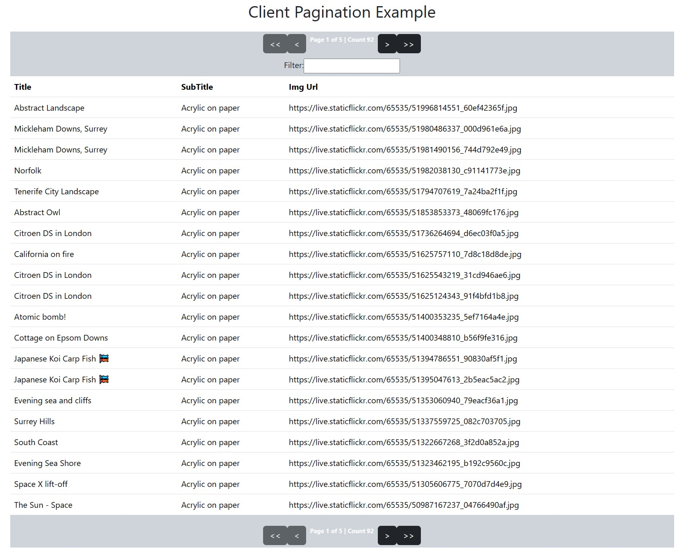

# ngx-client-pagination
Angular Client Pagination Component Lib Example

# Angular version;

16.0.2

# NPM Package;

npm i ngx-client-pagination

<https://www.npmjs.com/package/ngx-client-pagination>

# Stackblitz Example (old Angular 9 version);

<https://angular-client-pagination-example.stackblitz.io>

<https://stackblitz.com/edit/angular-client-pagination-example?file=src%2Fapp%2Fpagination%2Fcomponents%2Fdata-grid.component.html>

# Clone this repo and run NPM install and NG Serve for a running example 

Import 'NgxClientPaginationModule' into your Angular Module.

Add ngx-client-pagination-grid into your template;
```
<ngx-client-pagination-grid [data]="allData" [config]="{
  showFilter: true,
  showPaginationTop: true,
  showPaginationBottom: true,
  gridColumnNames: ['Title', 'SubTitle', 'Img Url'],
  gridFields: ['title', 'subTitle', 'urlOfContent']
}"></ngx-client-pagination-grid>
```


