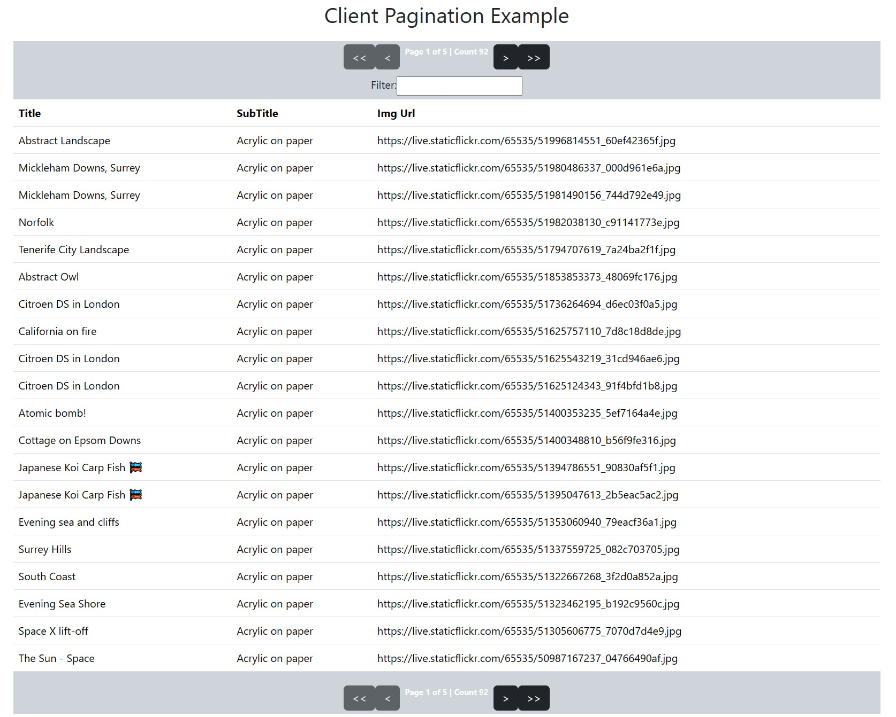

# ngx-em-pagination
Angular Client Pagination Component Lib Example

# Angular version;

16.0.2

# NPM Package;

npm i ngx-client-pagination

<https://www.npmjs.com/package/ngx-client-pagination>

# Stackblitz Example;

<https://angular-client-pagination-example.stackblitz.io>

<https://stackblitz.com/edit/angular-client-pagination-example?file=src%2Fapp%2Fpagination%2Fcomponents%2Fdata-grid.component.html>

# Clone this repo and run NPM install and NG Serve;

<https://github.com/Eugene-Murray/ngx-em-pagination>

